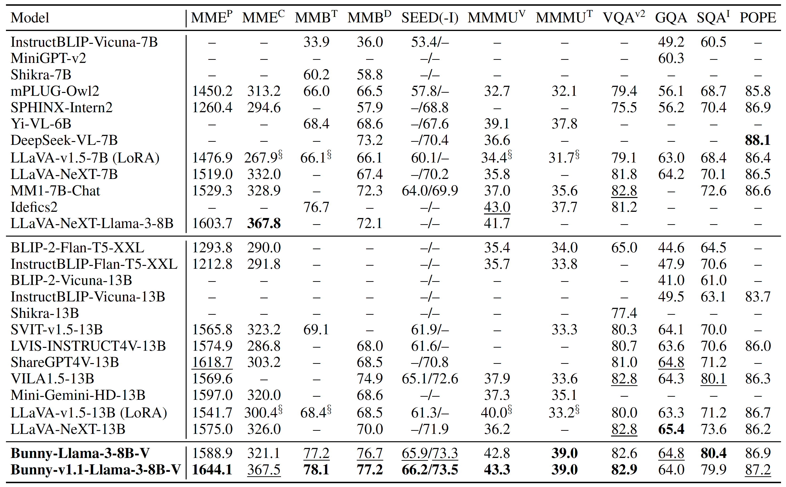

# Bunny: A family of lightweight multimodal models

<p align="center">
  
</p>

📖 [Technical report](https://arxiv.org/abs/2402.11530) | 🤗 Data ([v1.0](https://huggingface.co/datasets/BoyaWu10/Bunny-v1_0-data), [v1.1](https://huggingface.co/datasets/BoyaWu10/Bunny-v1_1-data)) | 🤖 Data ([v1.0](https://www.modelscope.cn/datasets/BoyaWu10/Bunny-v1.0-data), [v1.1](https://www.modelscope.cn/datasets/BoyaWu10/Bunny-v1.1-data)) | 🤗 [HFSpace](https://huggingface.co/spaces/BoZhaoHuggingFace/Bunny) 🐰 [Demo](http://bunny.baai.ac.cn)

**Bunny-v1.0-3B**: 🤗 [HuggingFace](https://huggingface.co/BAAI/Bunny-v1_0-3B) | 🤖 [ModelScope](https://www.modelscope.cn/models/BAAI/Bunny-v1.0-3B) | 🧠 [wisemodel](https://wisemodel.cn/models/BAAI/Bunny-v1.0-3B)

**Bunny-Llama-3-8B-V**: 🤗 [v1.1](https://huggingface.co/BAAI/Bunny-v1_1-Llama-3-8B-V) | 🤗 [v1.0](https://huggingface.co/BAAI/Bunny-Llama-3-8B-V) | 🤗 [v1.0-GGUF](https://huggingface.co/BAAI/Bunny-Llama-3-8B-V-gguf)

Bunny is a family of lightweight but powerful multimodal models. It offers multiple plug-and-play vision encoders, like **EVA-CLIP, SigLIP** and language backbones, including **Llama-3-8B, Phi-3-mini, Phi-1.5, StableLM-2, Qwen1.5, MiniCPM and Phi-2**. To compensate for the decrease in model size, we construct more informative training data by curated selection from a broader data source. Remarkably, our **Bunny-v1.0-3B** model built upon SigLIP and Phi-2 outperforms the state-of-the-art MLLMs, not only in comparison with models of similar size but also against larger MLLMs (7B), and even achieves performance on par with 13B models.

Moreover, we are thrilled to introduce **Bunny-Llama-3-8B-V**, the pioneering vision-language model based on Llama-3, showcasing exceptional performance. The v1.1 version accepts high-resolution images up to 1152x1152.



<details>
<summary>Expand to see the performance of Bunny-v1.0-3B</summary>

</details>


## News and Updates
* 2024.07.21 🔥 **SpatialBot, SpatialQA and SpatialBench are released!** SpatialBot is an embodiment model that comprehends spatial relationships by understanding and using depth information. Try model, dataset and benchmark at [GitHub](https://github.com/BAAI-DCAI/SpatialBot)!

* 2024.06.20 🔥 **MMR benchmark is released!** It is a benchmark for measuring MLLMs' understanding ability and their robustness against misleading questions. Check the performance of Bunny and more details in [GitHub](https://github.com/BAAI-DCAI/Multimodal-Robustness-Benchmark)!
* 2024.06.01 🔥 **Bunny-v1.1-Llama-3-8B-V, supporting 1152x1152 resolution, is released!** It is built upon SigLIP and Llama-3-8B-Instruct with S$`^2`$-Wrapper. Check more details in [HuggingFace](https://huggingface.co/BAAI/Bunny-v1_1-Llama-3-8B-V)! 🐰 [Demo](http://bunny.baai.ac.cn)

* 2024.05.08 🔥 **Bunny-v1.1-4B, supporting 1152x1152 resolution, is released!** It is built upon SigLIP and Phi-3-Mini-4K 3.8B with S$`^2`$-Wrapper. Check more details in [HuggingFace](https://huggingface.co/BAAI/Bunny-v1_1-4B)! 🐰 [Demo](http://bunny.baai.ac.cn)

* 2024.05.01 🔥 **Bunny-v1.0-4B, a vision-language model based on Phi-3, is released!** It is built upon SigLIP and Phi-3-Mini-4K 3.8B. Check more details in [HuggingFace](https://huggingface.co/BAAI/Bunny-v1_0-4B)! 🤗 [GGUF](https://huggingface.co/BAAI/Bunny-v1_0-4B-gguf)

* 2024.04.21 🔥 **Bunny-Llama-3-8B-V, the first vision-language model based on Llama-3, is released!** It is built upon SigLIP and Llama-3-8B-Instruct. Check more details in [HuggingFace](https://huggingface.co/BAAI/Bunny-Llama-3-8B-V), [ModelScope](https://www.modelscope.cn/models/BAAI/Bunny-Llama-3-8B-V), and [wisemodel](https://wisemodel.cn/models/BAAI/Bunny-Llama-3-8B-V)! 🤗 [GGUF](https://huggingface.co/BAAI/Bunny-Llama-3-8B-V-gguf)

* 2024.04.18 🔥 **Bunny-v1.0-3B-zh, powerful on English and Chinese, is released!** It is built upon SigLIP and MiniCPM-2B. Check more details in [HuggingFace](https://huggingface.co/BAAI/Bunny-v1_0-3B-zh), [ModelScope](https://www.modelscope.cn/models/BAAI/Bunny-v1.0-3B-zh/summary), and [wisemodel](https://wisemodel.cn/models/BAAI/Bunny-v1.0-3B-zh)! The evaluation results are in the [Model Zoo](#model-zoo). We sincerely thank Zhenwei Shao for his kind help.

* 2024.03.15 **Bunny-v1.0-2B-zh, focusing on Chinese, is released!** It is built upon SigLIP and Qwen1.5-1.8B. Check more details in [HuggingFace](https://huggingface.co/BAAI/Bunny-v1_0-2B-zh), [ModelScope](https://www.modelscope.cn/models/BAAI/Bunny-v1.0-2B-zh/summary), and [wisemodel](https://wisemodel.cn/models/BAAI/Bunny-v1.0-2B-zh)! The evaluation results are in the [Model Zoo](#model-zoo).

* 2024.03.06 **Bunny training data is released!** Check more details about Bunny-v1.0-data in [HuggingFace](https://huggingface.co/datasets/BoyaWu10/Bunny-v1_0-data) or [ModelScope](https://www.modelscope.cn/datasets/BoyaWu10/Bunny-v1.0-data)!
* 2024.02.20 **Bunny technical report is ready!** Check more details about Bunny [here](https://arxiv.org/abs/2402.11530)!
* 2024.02.07 **Bunny is released!** Bunny-v1.0-3B built upon SigLIP and Phi-2 outperforms the state-of-the-art MLLMs, not only in comparison with models of similar size but also against larger MLLMs (7B), and even achieves performance on par with LLaVA-13B!

## Quickstart

### HuggingFace transformers

Here we show a code snippet to show you how to use [Bunny-v1.1-Llama-3-8B-V](https://huggingface.co/BAAI/Bunny-v1_1-Llama-3-8B-V), [Bunny-v1.1-4B](https://huggingface.co/BAAI/Bunny-v1_1-4B), [Bunny-v1.0-3B](https://huggingface.co/BAAI/Bunny-v1_0-3B) and so on with HuggingFace transformers.

This snippet is only used for above models because we **manually** combine some configuration code into a single file for users' convenience. For example, you can check [`modeling_bunny_llama.py`](https://huggingface.co/BAAI/Bunny-v1_1-Llama-3-8B-V/blob/main/modeling_bunny_llama.py) and [`configuration_bunny_llama.py`](https://huggingface.co/BAAI/Bunny-v1_1-Llama-3-8B-V/blob/main/configuration_bunny_llama.py) and their related parts in the source code of Bunny to see the difference. For other models including models trained by yourself, we **recommend** loading them with installing the source code of Bunny. Or you can copy files like [`modeling_bunny_llama.py`](https://huggingface.co/BAAI/Bunny-v1_1-Llama-3-8B-V/blob/main/modeling_bunny_llama.py) and [`configuration_bunny_llama.py`](https://huggingface.co/BAAI/Bunny-v1_1-Llama-3-8B-V/blob/main/configuration_bunny_llama.py) into your model and modify `auto_map` in `config.json`, but we can't guarantee its correctness and you may need to modify some code to fit your model.

Before running the snippet, you need to install the following dependencies:

```shell
pip install torch transformers accelerate pillow
```

If the CUDA memory is enough, it would be faster to execute this snippet by setting `CUDA_VISIBLE_DEVICES=0`.

Users especially those in Chinese mainland may want to refer to a HuggingFace [mirror site](https://hf-mirror.com). 

```python
import torch
import transformers
from transformers import AutoModelForCausalLM, AutoTokenizer
from PIL import Image
import warnings

# disable some warnings
transformers.logging.set_verbosity_error()
transformers.logging.disable_progress_bar()
warnings.filterwarnings('ignore')

# set device
device = 'cuda'  # or cpu
torch.set_default_device(device)

model_name = 'BAAI/Bunny-v1_1-Llama-3-8B-V' # or 'BAAI/Bunny-Llama-3-8B-V' or 'BAAI/Bunny-v1_1-4B' or 'BAAI/Bunny-v1_0-4B' or 'BAAI/Bunny-v1_0-3B' or 'BAAI/Bunny-v1_0-3B-zh' or 'BAAI/Bunny-v1_0-2B-zh'
offset_bos = 1 # for Bunny-v1_1-Llama-3-8B-V, Bunny-Llama-3-8B-V, Bunny-v1_1-4B, Bunny-v1_0-4B and Bunny-v1_0-3B-zh
# offset_bos = 0 for Bunny-v1_0-3B and Bunny-v1_0-2B-zh

# create model
model = AutoModelForCausalLM.from_pretrained(
    model_name,
    torch_dtype=torch.float16, # float32 for cpu
    device_map='auto',
    trust_remote_code=True)
tokenizer = AutoTokenizer.from_pretrained(
    model_name,
    trust_remote_code=True)

# text prompt
prompt = 'Why is the image funny?'
text = f"A chat between a curious user and an artificial intelligence assistant. The assistant gives helpful, detailed, and polite answers to the user's questions. USER: <image>\n{prompt} ASSISTANT:"
text_chunks = [tokenizer(chunk).input_ids for chunk in text.split('<image>')]
input_ids = torch.tensor(text_chunks[0] + [-200] + text_chunks[1][offset_bos:], dtype=torch.long).unsqueeze(0).to(device)

# image, sample images can be found in https://huggingface.co/BAAI/Bunny-v1_1-Llama-3-8B-V/tree/main/images
image = Image.open('example_2.png')
image_tensor = model.process_images([image], model.config).to(dtype=model.dtype, device=device)

# generate
output_ids = model.generate(
    input_ids,
    images=image_tensor,
    max_new_tokens=100,
    use_cache=True,
    repetition_penalty=1.0 # increase this to avoid chattering
)[0]

print(tokenizer.decode(output_ids[input_ids.shape[1]:], skip_special_tokens=True).strip())
```

### ModelScope

We advise users especially those in Chinese mainland to use ModelScope.
`snapshot_download` can help you solve issues concerning downloading checkpoints.

<details>
<summary>Expand to see the snippet</summary>

Before running the snippet, you need to install the following dependencies:


```shell
pip install torch modelscope transformers accelerate pillow
```
If the CUDA memory is enough, it would be faster to execute this snippet by setting `CUDA_VISIBLE_DEVICES=0`.

```python
import torch
import transformers
from modelscope import AutoTokenizer, AutoModelForCausalLM
from modelscope.hub.snapshot_download import snapshot_download
from PIL import Image
import warnings

# disable some warnings
transformers.logging.set_verbosity_error()
transformers.logging.disable_progress_bar()
warnings.filterwarnings('ignore')

# set device
device = 'cuda'  # or cpu
torch.set_default_device(device)

model_name = 'BAAI/Bunny-Llama-3-8B-V' # or 'BAAI/Bunny-v1.0-3B' or 'BAAI/Bunny-v1.0-3B-zh' or 'BAAI/Bunny-v1.0-2B-zh'
offset_bos = 1 # for Bunny-Llama-3-8B-V and Bunny-v1.0-3B-zh
# offset_bos = 0 for Bunny-v1.0-3B and Bunny-v1.0-2B-zh

# create model
snapshot_download(model_id='thomas/siglip-so400m-patch14-384')
model = AutoModelForCausalLM.from_pretrained(
    model_name,
    torch_dtype=torch.float16, # float32 for cpu
    device_map='auto',
    trust_remote_code=True)
tokenizer = AutoTokenizer.from_pretrained(
    model_name,
    trust_remote_code=True)

# text prompt
prompt = 'Why is the image funny?'
text = f"A chat between a curious user and an artificial intelligence assistant. The assistant gives helpful, detailed, and polite answers to the user's questions. USER: <image>\n{prompt} ASSISTANT:"
text_chunks = [tokenizer(chunk).input_ids for chunk in text.split('<image>')]
input_ids = torch.tensor(text_chunks[0] + [-200] + text_chunks[1][offset_bos:], dtype=torch.long).unsqueeze(0).to(device)

# image, sample images can be found in images folder on https://www.modelscope.cn/models/BAAI/Bunny-Llama-3-8B-V/files
image = Image.open('example_2.png')
image_tensor = model.process_images([image], model.config).to(dtype=model.dtype, device=device)

# generate
output_ids = model.generate(
    input_ids,
    images=image_tensor,
    max_new_tokens=100,
    use_cache=True,
    repetition_penalty=1.0 # increase this to avoid chattering
)[0]

print(tokenizer.decode(output_ids[input_ids.shape[1]:], skip_special_tokens=True).strip())
```

</details>

## Model Zoo

* Evaluation

| Checkpoint                                                   | MME$`^\text{P}`$ | MME$`^\text{C}`$ | MMB$`^{\text{T}/\text{D}}`$ | MMB-CN$`^{\text{T}/ \text{D}}`$ | SEED(-IMG) | MMMU$`^{\text{V}/\text{T}}`$ | VQA$`^\text{v2}`$ | GQA  | SQA$`^\text{I}`$ | POPE |
| :----------------------------------------------------------- | :--------------: | :--------------: | :--------------: | :--------------: | :--------------: | :--: | :---------------: | :---------------: | :---------------: | :--: |
| [bunny-phi-1.5-eva-lora](https://huggingface.co/BoyaWu10/bunny-phi-1.5-eva-lora) |      1213.7      |      278.9      |       60.9/56.8       |       -       | 56.4/64.1 | 30.0/28.4 | 76.5 |       60.4       |       58.2       | 86.1 |
| [bunny-stablelm-2-eva-lora](https://huggingface.co/BoyaWu10/bunny-stablelm-2-eva-lora) |      1301.0      |      235.0       |       58.4/56.4       |       -       | 55.3/62.8 | 29.8/29.4 | 74.6 |       56.7       |       60.0    | 84.8 |
| [bunny-phi-2-eva-lora](https://huggingface.co/BoyaWu10/bunny-phi-2-eva-lora) |      1421.0      |      285.4      |       68.6/67.4       |       -       | 62.2/70.2 | 35.9/32.6 | 78.9 |       62.3       |       69.1       | 87.1 |
| [bunny-phi-1.5-siglip-lora](https://huggingface.co/BoyaWu10/bunny-phi-1.5-siglip-lora) |      1230.0      |      237.5      |       61.2/59.7       |       -       | 57.7/65.3 | 30.0/29.1 | 78.0 |       61.1       |       61.3       | 85.8 |
| [bunny-stablelm-2-siglip-lora](https://huggingface.co/BoyaWu10/bunny-stablelm-2-siglip-lora) |      1366.8      |      236.1       |       65.1/62.8       |       -       | 58.8/67.5 | 29.9/29.8 | 78.9 |       60.9       |       61.1    | 85.9 |
| [Bunny-v1.0-2B-zh/bunny-qwen1.5-1.8b-siglip](https://huggingface.co/BAAI/Bunny-v1_0-2B-zh) |      1300.8      |      254.3      |       59.8/59.1       |       59.5/58.5       | 55.4/62.3 | 34.4/30.4 | 76.6 |       59.6       |       64.6       | 85.8 |
| [Bunny-v1.0-3B-zh/bunny-minicpm-siglip](https://huggingface.co/BAAI/Bunny-v1_0-3B-zh) |      1410.4      |      281.4      |       66.1/65.5       |       64.9/63.6       | 59.6/67.3 | 35.4/32.4 | 78.6 |       60.8       |       68.7       | 86.5 |
| **[Bunny-v1.0-3B/bunny-phi-2-siglip](https://huggingface.co/BAAI/Bunny-v1_0-3B)** |      1488.8      |      289.3      |       69.2/68.6       |       -       | 62.5/70.7 | 38.2/33.0 | 79.8 |       62.5       |       70.9       | 86.8 |
| [Bunny-v1.0-4B](https://huggingface.co/BAAI/Bunny-v1_0-4B) |      1495.2      |      338.9      |       74.0/73.5       |       -       | 64.5/72.1 | 40.1/39.1 | 81.5 |       63.5       |       75.2       | 86.7 |
| **[Bunny-v1.1-4B](https://huggingface.co/BAAI/Bunny-v1_1-4B)** |      1581.5      |      361.1      |       75.7/74.2       |       66.5/64.5       | 64.9/72.5 | 41.4/38.4 | 82.1 |       63.2       |       78.3       | 87.2 |
| [Bunny-Llama-3-8B-V](https://huggingface.co/BAAI/Bunny-Llama-3-8B-V) |      1588.9      |      321.1      |       77.2/76.7       |       73.8/72.3       | 65.9/73.3 | 42.8/39.0 | 82.6 |       64.8       |       80.4       | 86.9 |
| **[Bunny-1.1-Llama-3-8B-V](https://huggingface.co/BAAI/Bunny-v1_1-Llama-3-8B-V)** |      1644.1      |      367.5      |       78.1/77.2       |       74.3/74.8       | 66.2/73.5 | 43.3/39.0 | 82.9 |       64.0       |       79.9       | 87.2 |

The small model with the best performance is denoted as Bunny-v1.0-3B or bunny-phi-2-siglip, whose merged weights can be found [here](https://huggingface.co/BAAI/Bunny-v1_0-3B) and the LoRA weights can be found [here](https://huggingface.co/BAAI/bunny-phi-2-siglip-lora).

We also provide two models that focus on Chinese QA ability, namely Bunny-v1.0-3B-zh (bunny-minicpm-siglip) and Bunny-v1.0-2B-zh (bunny-qwen1.5-1.8b-siglip). The merged weights can be found [here](https://huggingface.co/BAAI/Bunny-v1_0-3B-zh) and [here](https://huggingface.co/BAAI/Bunny-v1_0-2B-zh). The LoRA weights can be found [here](https://huggingface.co/BoyaWu10/bunny-minicpm-siglip-lora) and [here](https://huggingface.co/BoyaWu10/bunny-qwen1.5-1.8b-siglip-lora).

* Training details
  
| Checkpoint                                                   | Vision Encoder                                               | LLM                                                          | Pretrain lr | Pretrain weights                                             |
| ------------------------------------------------------------ | ------------------------------------------------------------ | ------------------------------------------------------------ | :---------: | ------------------------------------------------------------ |
| [bunny-phi-1.5-eva-lora](https://huggingface.co/BoyaWu10/bunny-phi-1.5-eva-lora) | [EVA02_CLIP_L_336_psz14_s6B](https://huggingface.co/QuanSun/EVA-CLIP/blob/main/EVA02_CLIP_L_336_psz14_s6B.pt) | [microsoft/phi-1_5](https://huggingface.co/microsoft/phi-1_5) |    1e-3     | [bunny-pretrain-phi-1.5-eva](https://huggingface.co/BoyaWu10/bunny-pretrain-phi-1.5-eva) |
| [bunny-stablelm-2-eva-lora](https://huggingface.co/BoyaWu10/bunny-stablelm-2-eva-lora) | [EVA02_CLIP_L_336_psz14_s6B](https://huggingface.co/QuanSun/EVA-CLIP/blob/main/EVA02_CLIP_L_336_psz14_s6B.pt) | [stabilityai/stablelm-2-1_6b](https://huggingface.co/stabilityai/stablelm-2-1_6b) |    1e-3     | [bunny-pretrain-stablelm-2-eva](https://huggingface.co/BoyaWu10/bunny-pretrain-stablelm-2-eva) |
| [bunny-phi-2-eva-lora](https://huggingface.co/BoyaWu10/bunny-phi-2-eva-lora) | [EVA02_CLIP_L_336_psz14_s6B](https://huggingface.co/QuanSun/EVA-CLIP/blob/main/EVA02_CLIP_L_336_psz14_s6B.pt) | [microsoft/phi-2](https://huggingface.co/microsoft/phi-2)    |    5e-5     | [bunny-pretrain-phi-2-eva](https://huggingface.co/BoyaWu10/bunny-pretrain-phi-2-eva) |
| [bunny-phi-1.5-siglip-lora](https://huggingface.co/BoyaWu10/bunny-phi-1.5-siglip-lora) | [siglip-so400m-patch14-384](https://huggingface.co/google/siglip-so400m-patch14-384) | [microsoft/phi-1_5](https://huggingface.co/microsoft/phi-1_5) |    5e-4     | [bunny-pretrain-phi-1.5-siglip](https://huggingface.co/BoyaWu10/bunny-pretrain-phi-1.5-siglip) |
| [bunny-stablelm-2-siglip-lora](https://huggingface.co/BoyaWu10/bunny-stablelm-2-siglip-lora) | [siglip-so400m-patch14-384](https://huggingface.co/google/siglip-so400m-patch14-384) | [stabilityai/stablelm-2-1_6b](https://huggingface.co/stabilityai/stablelm-2-1_6b) |    5e-4     | [bunny-pretrain-stablelm-2-siglip](https://huggingface.co/BoyaWu10/bunny-pretrain-stablelm-2-siglip) |
| [bunny-qwen1.5-1.8b-siglip-lora](https://huggingface.co/BoyaWu10/bunny-qwen1.5-1.8b-siglip-lora) | [siglip-so400m-patch14-384](https://huggingface.co/google/siglip-so400m-patch14-384) | [Qwen/Qwen1.5-1.8B](https://huggingface.co/Qwen/Qwen1.5-1.8B) |    5e-4     | [bunny-pretrain-qwen1.5-1.8b-siglip](https://huggingface.co/BoyaWu10/bunny-pretrain-qwen1.5-1.8b-siglip) |
| [bunny-minicpm-siglip-lora](https://huggingface.co/BoyaWu10/bunny-minicpm-siglip-lora) | [siglip-so400m-patch14-384](https://huggingface.co/google/siglip-so400m-patch14-384) | [openbmb/MiniCPM-2B-history](https://huggingface.co/openbmb/MiniCPM-2B-history) (step 280000) |    5e-4     | [bunny-pretrain-minicpm-siglip](https://huggingface.co/BoyaWu10/bunny-pretrain-minicpm-siglip) |
| **[bunny-phi-2-siglip-lora](https://huggingface.co/BAAI/bunny-phi-2-siglip-lora)** | [siglip-so400m-patch14-384](https://huggingface.co/google/siglip-so400m-patch14-384) | [microsoft/phi-2](https://huggingface.co/microsoft/phi-2)    |    5e-4     | [bunny-pretrain-phi-2-siglip](https://huggingface.co/BAAI/bunny-pretrain-phi-2-siglip) |
| Bunny-v1.0-4B                                            | [siglip-so400m-patch14-384](https://huggingface.co/google/siglip-so400m-patch14-384) | [microsoft/Phi-3-mini-4k-instruct](https://huggingface.co/microsoft/Phi-3-mini-4k-instruct) |    1e-3     | [bunny-pretrain-phi-3-siglip](https://huggingface.co/BoyaWu10/bunny-pretrain-phi-3-siglip) |
| **Bunny-v1.1-4B**                                            | [siglip-so400m-patch14-384](https://huggingface.co/google/siglip-so400m-patch14-384) | [microsoft/Phi-3-mini-4k-instruct](https://huggingface.co/microsoft/Phi-3-mini-4k-instruct) |    1e-3     | [bunny-pretrain-phi-3-siglip-s2](https://huggingface.co/BoyaWu10/bunny-pretrain-phi-3-siglip-s2) |
| Bunny-Llama-3-8B-V                                       | [siglip-so400m-patch14-384](https://huggingface.co/google/siglip-so400m-patch14-384) | [meta-llama/Meta-Llama-3-8B-Instruct](https://huggingface.co/meta-llama/Meta-Llama-3-8B-Instruct) |    1e-3     | [bunny-pretrain-llama3-8b-siglip](https://huggingface.co/BoyaWu10/bunny-pretrain-llama3-8b-siglip) |
| **Bunny-v1.1-Llama-3-8B-V**                                       | [siglip-so400m-patch14-384](https://huggingface.co/google/siglip-so400m-patch14-384) | [meta-llama/Meta-Llama-3-8B-Instruct](https://huggingface.co/meta-llama/Meta-Llama-3-8B-Instruct) |    1e-3     | [bunny-pretrain-llama3-8b-siglip-s2](https://huggingface.co/BoyaWu10/bunny-pretrain-llama3-8b-siglip-s2) |

## Install
Either start from our docker or install locally on your own. 

### Start from Our Docker
Directly start from our configured docker image by `docker pull russellrobin/bunny:latest`. 

<details>
<summary>Expand to see how to keep codes up to date.</summary>
Although this docker is under regular maintenance by us, local Bunny codes aren't guaranteed to be kept up to date with our GitHub repo. 
You may want to:

1. Run `pip install --upgrade transformers && cd Bunny` in a running container,

2. Set default GitHub identity by `git config user.email "you@example.com" && git config user.name "Your Name"`,

3. Update Bunny local codes using `git pull`. 

4. `pip install -e .`

You are all set!
</details>

### Local Installation
* CUDA and cuDNN

  We use CUDA 11.8 and cuDNN 8.7.0. We actually use the CUDA docker by NVIDIA: `docker pull nvcr.io/nvidia/cuda:11.8.0-cudnn8-devel-ubuntu20.04`. CUDA 12 is fine, too.

* Create a conda virtual environment and activate it:

  ```shell
  conda create -n bunny python=3.10
  conda activate bunny
  ```

* Basic requirements

  ```shell
  pip install --upgrade pip  # enable PEP 660 support
  pip install transformers
  pip install torch torchvision xformers --index-url https://download.pytorch.org/whl/cu118
  ```

* Install apex

  ```shell
  # https://github.com/NVIDIA/apex#from-source
  pip install ninja
  git clone https://github.com/NVIDIA/apex
  cd apex
  # if pip >= 23.1 (ref: https://pip.pypa.io/en/stable/news/#v23-1) which supports multiple `--config-settings` with the same key...
  pip install -v --disable-pip-version-check --no-cache-dir --no-build-isolation --config-settings "--build-option=--cpp_ext" --config-settings "--build-option=--cuda_ext" ./
  # otherwise
  pip install -v --disable-pip-version-check --no-cache-dir --no-build-isolation --global-option="--cpp_ext" --global-option="--cuda_ext" ./
  ```

* Install flash-attention

  ```shell
  # https://github.com/Dao-AILab/flash-attention?tab=readme-ov-file#installation-and-features
  pip install packaging
  pip install flash-attn --no-build-isolation
  ```

* Install bunny and other requirements

  ```shell
  git clone https://github.com/BAAI-DCAI/Bunny.git
  cd Bunny
  pip install -e .
  ```

## Training

Bunny training consists of two stages: (1) pretrain stage: use data to connect a *frozen pretrained* vision encoder to a *frozen* LLM, and only the connector is trained; (2) visual instruction tuning stage: use data to teach the model to follow multimodal instructions, where the connector and learnable LLM parameters are updated.

Bunny is trained on 8 A100 GPUs. Under other circumstances, you can reduce the `per_device_train_batch_size` and increase the `gradient_accumulation_steps` accordingly. Always keep the global batch size the same: `global_batch_size ` = `per_device_train_batch_size` $`\times`$ `gradient_accumulation_steps` $`\times`$ `num_gpus`.

### Support Models

Currently, we support several vision encoders and LLMs.

For vision encoders, we support CLIP, EVA-CLIP and SigLIP.

| Vision Encoders            | Download Link                                                |
| -------------------------- | ------------------------------------------------------------ |
| clip-vit-large-patch14-336 | [openai/clip-vit-large-patch14-336](https://huggingface.co/openai/clip-vit-large-patch14-336) |
| EVA02_CLIP_L_336_psz14_s6B | [QuanSun/EVA-CLIP](https://huggingface.co/QuanSun/EVA-CLIP/blob/main/EVA02_CLIP_L_336_psz14_s6B.pt) |
| siglip-so400m-patch14-384  | [google/siglip-so400m-patch14-384](https://huggingface.co/google/siglip-so400m-patch14-384) |

For LLMs, we support phi-1.5, stablelm-2, qwen1.5-1.8b, minicpm, phi-2, phi-3 and llama3-8b.

| MODEL_TYPE | LLM             | Download Link                                                |
| ---------- | --------------- | ------------------------------------------------------------ |
| phi-1.5    | phi-1_5     | [microsoft/phi-1_5](https://huggingface.co/microsoft/phi-1_5) |
| stablelm-2 | stablelm-2-1_6b | [stabilityai/stablelm-2-1_6b](https://huggingface.co/stabilityai/stablelm-2-1_6b) |
| qwen1.5-1.8b | Qwen1.5-1.8B | [Qwen/Qwen1.5-1.8B](https://huggingface.co/Qwen/Qwen1.5-1.8B) |
| minicpm | MiniCPM-2B | [openbmb/MiniCPM-2B-history](https://huggingface.co/openbmb/MiniCPM-2B-history) (step 280000) |
| phi-2 | phi-2 | [microsoft/phi-2](https://huggingface.co/microsoft/phi-2) |
| phi-3 | Phi-3-mini-4k-instruct | [microsoft/Phi-3-mini-4k-instruct](https://huggingface.co/microsoft/Phi-3-mini-4k-instruct) |
| llama3-8b | Meta-Llama-3-8B-Instruct | [meta-llama/Meta-Llama-3-8B-Instruct](https://huggingface.co/meta-llama/Meta-Llama-3-8B-Instruct) |

Note that there are many variants of above models.
We build and test our code based on the exact versions mentioned above.
More models will be supported in the future!

### Pretrain

* Data preparation

  We use a high-quality coreset with less duplicates and more informative samples of LAION-2B built by [this work](https://github.com/BAAI-DCAI/Dataset-Pruning/tree/main/LAION). We randomly sample 2 million image-text pairs from the coreset and convert them to training format.
  The dataset is available [here](https://huggingface.co/datasets/BoyaWu10/Bunny-v1_0-data).

* Run

  Update `--model_name_or_path` and `--vision_tower` to the paths of the LLM and vision encoder, respectively. Update `MODEL_TYPE` and `OUTPUT_DIR` accordingly. The global batch size is 256. The optimal learning rate varies for different settings and we list the `lr` in our experiments in the [Model Zoo](#model-zoo). S$`^2`$-Wrapper would be enabled if `--use_s2 True` added.
  
  ```shell
  sh script/train/pretrain.sh
  ```

### Visual Instruction Tuning

* Data preparation

  We build Bunny-695K by modifying [SVIT-mix-665K](https://arxiv.org/abs/2307.04087) for finetuning.
  The dataset is available [here](https://huggingface.co/datasets/BoyaWu10/Bunny-v1_0-data).

* Run

  Update `--model_name_or_path` and `--vision_tower` to the paths of the LLM and vision encoder, respectively. Update `MODEL_TYPE`, `PRETRAIN_DIR` and `OUTPUT_DIR` accordingly. The global batch size is 128. For `MODEL_TYPE = minicpm/phi-3/llama3-8b`, change `--version` to `minicpm/phi3/llama`, too. S$`^2`$-Wrapper would be enabled if `--use_s2 True` added.
  
  *We use a better strategy to train Phi-3-Mini-based and Llama-3-8B-based Bunny, which would be open-sourced soon!*
  
  ```shell
  # full-parameter tuning
  sh script/train/finetune_full.sh
  
  # LoRA tuning
  sh script/train/finetune_lora.sh
  ```
### Continuous  Fine-tuning

If you want to continuously fine-tuning our released Bunny models on your data or to adapt certain task, 

<details>
<summary>expand to see the instructions.</summary>


1. Prepare data: convert your data to a `JSON` file of a list of all samples with the format like [Bunny-695K](https://huggingface.co/datasets/BoyaWu10/Bunny-v1_0-data/blob/main/finetune/bunny_695k.json).

2. Prepare model:

   * download Bunny [models](#model-zoo) and if only LoRA provided, merge the LoRA weights and base LLM

     ```shell
     python script/merge_lora_weights.py \
       --model-path /path/to/bunny_lora_weights \
       --model-base /path/to/base_llm_model \
       --model-type phi-2 (or stablelm-2 or phi-1.5 or qwen1.5-1.8b or minicpm or phi-3 or llama3-8b) \
       --save-model-path /path/to/merged_model
     ```
   * add `"continuous_training": true` in `/path/to/merged_model/config.json` to ensure loading the vision tower from merged weights
   


3. Edit script: both `finetune_full.sh` and `finetune_lora.sh` can be used, before:

   * change `--model_name_or_path` to `/path/to/merged_model`

   * delete `--pretrain_mm_mlp_adapter` because we load the cross-modality projector from merged weights

   * customize the hyperparameters, e.g. the learning rate, to fit your dataset
   
   * for `MODEL_TYPE = minicpm/phi-3/llama3-8b`, change `--version` to `minicpm/phi3/llama`, too. S$`^2`$-Wrapper would be enabled if `--use_s2 True` added.

</details>

## Demo

### Gradio Web UI

* Starting the Controller

  First, start the controller. This service orchestrates communication between the web server and model workers.
  
  ```shell
  python -m bunny.serve.controller \
  	--host 0.0.0.0 \
  	--port 10000
  ```

* Launching the Gradio Web Server

  To interact with the models through a web interface, start the Gradio web server.

  Basic start:

  ```shell
  python -m bunny.serve.gradio_web_server \
  	--controller http://localhost:10000 \
  	--model-list-mode reload
  ```

  If you want to share your web server with others, use `--share` option. Note that `frpc_linux_amd64_v0.2` may be missing and you can fix it following instructions printed on the screen and making the file executable.

  ```shell
  python -m bunny.serve.gradio_web_server \
  	--controller http://localhost:10000 \
  	--model-list-mode reload \
  	--share
  ```

  Now, you can open the web interface with **the URL printed on the screen**. You may notice that there is no model in the model list. Do not worry, as we have not launched any model worker yet. It will be automatically updated when you launch a model worker.

* Launching Model Workers

  Model workers handle the processing of model inferences. Configure each worker with the appropriate model and start it. Note to check whether `conv_mode` is correct [here](https://github.com/BAAI-DCAI/Bunny/blob/main/bunny/serve/gradio_web_server.py#L194) which is decided by the name (path) of the model.

  * For full-parameter tuning models

      ```shell
      python -m bunny.serve.model_worker \
        --host 0.0.0.0 \
        --controller http://localhost:10000 \
        --port 40000 \
        --worker http://localhost:40000 \
        --model-path /path/to/bunny/model \
        --model-type phi-2 (or stablelm-2 or phi-1.5 or qwen1.5-1.8b or minicpm or phi-3 or llama3-8b)
      ```

  * For LoRA tuning models

      You can use `script/merge_lora_weights.py` to merge the LoRA weights and base LLM, and use it as above.
      
      ```Shell
      python script/merge_lora_weights.py \
        --model-path /path/to/bunny_lora_weights \
        --model-base /path/to/base_llm_model \
        --model-type phi-2 (or stablelm-2 or phi-1.5 or qwen1.5-1.8b or minicpm or phi-3 or llama3-8b) \
        --save-model-path /path/to/merged_model
      ```
      Or you can use it without merging as below.
      
      ```shell
      python -m bunny.serve.model_worker \
        --host 0.0.0.0 \
        --controller http://localhost:10000 \
        --port 40000 \
        --worker http://localhost:40000 \
        --model-path /path/to/bunny_lora_weights \
        --model-base /path/to/base_llm_model \
        --model-type phi-2 (or stablelm-2 or phi-1.5 or qwen1.5-1.8b or minicpm or phi-3 or llama3-8b)
      ```


### CLI Inference (Without Gradio Interface)

For CLI-based inference without using the Gradio interface, use the following command:

* For full-parameter tuning models

  ```shell
  python -m bunny.serve.cli \
  	--model-path /path/to/bunny/model \
  	--model-type phi-2 (or stablelm-2 or phi-1.5 or qwen1.5-1.8b or minicpm) \
  	--image-file /path/to/the/test/image \
  	--conv-mode bunny (change to minicpm/phi3/llama for model-type = minicpm/phi-3/llama3-8b)
  ```

* For LoRA tuning models

  You can use `script/merge_lora_weights.py` to merge the LoRA weights and base LLM, and use it as above.

  ```Shell
  python script/merge_lora_weights.py \
  	--model-path /path/to/bunny_lora_weights \
  	--model-base /path/to/base_llm_model \
  	--model-type phi-2 (or stablelm-2 or phi-1.5 or qwen1.5-1.8b or minicpm or phi-3 or llama3-8b) \
  	--save-model-path /path/to/merged_model
  ```

  Or you can use it without merging as below.

  ```shell
  python -m bunny.serve.cli \
  	--model-path /path/to/bunny_lora_weights \
  	--model-base /path/to/base_llm_model \
  	--model-type phi-2 (or stablelm-2 or phi-1.5 or qwen1.5-1.8b or minicpm or phi-3 or llama3-8b) \
  	--image-file /path/to/the/test/image \
  	--conv-mode bunny (change to minicpm/phi3/llama for model-type = minicpm/phi-3/llama3-8b)
  ```

You can also control `temperature`, `repetition-penalty` and `max-new-tokens`.

## Evaluation

For full-parameter tuning models, see [evaluation_full.md](script/eval/full/evaluation_full.md).

For LoRA tuning models, see [evaluation_lora.md](script/eval/lora/evaluation_lora.md).

## Citation
If you find this repository helpful, please cite the paper below.

```bibtex
@article{he2024bunny,
      title={Efficient Multimodal Learning from Data-centric Perspective}, 
      author={He, Muyang and Liu, Yexin and Wu, Boya and Yuan, Jianhao and Wang, Yueze and Huang, Tiejun and Zhao, Bo},
      journal={arXiv preprint arXiv:2402.11530},
      year={2024}
}
```

## License
This project utilizes certain datasets and checkpoints that are subject to their respective original licenses. Users must comply with all terms and conditions of these original licenses.
The content of this project itself is licensed under the [Apache license 2.0](./LICENSE).

## Acknowledgement

We build our project based on [LLaVA](https://github.com/haotian-liu/LLaVA): Large Language and Vision Assistant.
