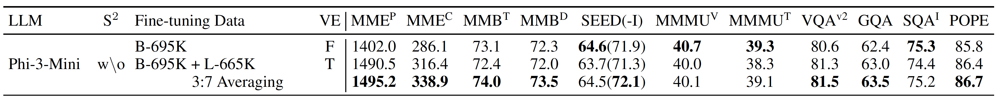

# Training Tutorial of Bunny-v1.0-4B



## Pretrain

```shell
#!/bin/bash

MODEL_TYPE=phi-3
OUTPUT_DIR=bunny-$MODEL_TYPE-pretrain

mkdir -p ./checkpoints-pretrain/$OUTPUT_DIR

deepspeed bunny/train/train.py \
    --deepspeed ./script/deepspeed/zero2.json \
    --model_name_or_path /path/to/microsoft/Phi-3-mini-4k-instruct \
    --model_type $MODEL_TYPE \
    --version plain \
    --data_path ./data/pretrain/bunny_pretrain_laion_2m.json \
    --image_folder ./data/pretrain/images \
    --vision_tower /path/to/siglip-so400m-patch14-384 \
    --mm_projector_type mlp2x_gelu \
    --tune_mm_mlp_adapter True \
    --image_aspect_ratio square \
    --bf16 True \
    --output_dir ./checkpoints-pretrain/$OUTPUT_DIR \
    --num_train_epochs 1 \
    --per_device_train_batch_size 8 \
    --per_device_eval_batch_size 4 \
    --gradient_accumulation_steps 4 \
    --evaluation_strategy "no" \
    --save_strategy "steps" \
    --save_steps 24000 \
    --save_total_limit 1 \
    --learning_rate 1e-3 \
    --weight_decay 0. \
    --warmup_ratio 0.03 \
    --lr_scheduler_type "cosine" \
    --logging_steps 1 \
    --tf32 True \
    --model_max_length 2048 \
    --gradient_checkpointing True \
    --dataloader_num_workers 4 \
    --lazy_preprocess True \
    --report_to none | tee 2>&1 ./checkpoints-pretrain/$OUTPUT_DIR/log.txt
```

## Visual Instruction Tuning

### Recipe-1

```shell
#!/bin/bash

MODEL_TYPE=phi-3

PRETRAIN_DIR=bunny-$MODEL_TYPE-pretrain
OUTPUT_DIR=bunny-lora-$MODEL_TYPE-recipe-1

mkdir -p ./checkpoints-$MODEL_TYPE/$OUTPUT_DIR

deepspeed bunny/train/train.py \
    --lora_enable True --lora_r 128 --lora_alpha 256 --mm_projector_lr 2e-5 \
    --deepspeed ./script/deepspeed/zero3.json \
    --model_name_or_path /path/to/microsoft/Phi-3-mini-4k-instruct \
    --model_type $MODEL_TYPE \
    --version phi3 \
    --data_path ./data/finetune/bunny_695k.json \
    --image_folder ./data/finetune/images \
    --vision_tower /path/to/siglip-so400m-patch14-384 \
    --pretrain_mm_mlp_adapter ./checkpoints-pretrain/$PRETRAIN_DIR/mm_projector.bin \
    --mm_projector_type mlp2x_gelu \
    --image_aspect_ratio pad \
    --group_by_modality_length False \
    --bf16 True \
    --output_dir ./checkpoints-$MODEL_TYPE/$OUTPUT_DIR \
    --num_train_epochs 1 \
    --per_device_train_batch_size 4 \
    --per_device_eval_batch_size 4 \
    --gradient_accumulation_steps 4 \
    --evaluation_strategy "no" \
    --save_strategy "steps" \
    --save_steps 500 \
    --save_total_limit 1 \
    --learning_rate 2e-4 \
    --weight_decay 0. \
    --warmup_ratio 0.03 \
    --lr_scheduler_type "cosine" \
    --logging_steps 1 \
    --tf32 True \
    --model_max_length 4096 \
    --gradient_checkpointing True \
    --dataloader_num_workers 4 \
    --lazy_preprocess True \
    --report_to none | tee 2>&1 ./checkpoints-$MODEL_TYPE/$OUTPUT_DIR/log.txt
```

### Recipe-2

```shell
#!/bin/bash

MODEL_TYPE=phi-3

PRETRAIN_DIR=bunny-$MODEL_TYPE-pretrain
OUTPUT_DIR=bunny-lora-$MODEL_TYPE-recipe-2

mkdir -p ./checkpoints-$MODEL_TYPE/$OUTPUT_DIR

deepspeed bunny/train/train.py \
    --lora_enable True --lora_r 128 --lora_alpha 256 --mm_projector_lr 2e-5 \
    --deepspeed ./script/deepspeed/zero3.json \
    --model_name_or_path /path/to/microsoft/Phi-3-mini-4k-instruct \
    --model_type $MODEL_TYPE \
    --version phi3 \
    --data_path ./data/finetune/bunny_llava_1.4m.json \
    --image_folder ./data/finetune/images \
    --vision_tower /path/to/siglip-so400m-patch14-384 \
    --unfreeze_vision_tower True \
    --pretrain_mm_mlp_adapter ./checkpoints-pretrain/$PRETRAIN_DIR/mm_projector.bin \
    --mm_projector_type mlp2x_gelu \
    --image_aspect_ratio pad \
    --group_by_modality_length False \
    --bf16 True \
    --output_dir ./checkpoints-$MODEL_TYPE/$OUTPUT_DIR \
    --num_train_epochs 1 \
    --per_device_train_batch_size 4 \
    --per_device_eval_batch_size 4 \
    --gradient_accumulation_steps 4 \
    --evaluation_strategy "no" \
    --save_strategy "steps" \
    --save_steps 500 \
    --save_total_limit 1 \
    --learning_rate 2e-4 \
    --weight_decay 0. \
    --warmup_ratio 0.03 \
    --lr_scheduler_type "cosine" \
    --logging_steps 1 \
    --tf32 True \
    --model_max_length 4096 \
    --gradient_checkpointing True \
    --dataloader_num_workers 4 \
    --lazy_preprocess True \
    --report_to none | tee 2>&1 ./checkpoints-$MODEL_TYPE/$OUTPUT_DIR/log.txt
```

### Weight Merging

* Firstly, merge the LoRA weights and base LLM

  ```shell
  python script/merge_lora_weights.py \
    --model-path ./checkpoints-phi-3/bunny-lora-phi-3-recipe-1 \
    --model-base /path/to/microsoft/Phi-3-mini-4k-instruct \
    --model-type phi-3 \
    --save-model-path ./checkpoints-phi-3/bunny-phi-3-recipe-1
  ```

  ```shell
  python script/merge_lora_weights.py \
    --model-path ./checkpoints-phi-3/bunny-lora-phi-3-recipe-2 \
    --model-base /path/to/microsoft/Phi-3-mini-4k-instruct \
    --model-type phi-3 \
    --save-model-path ./checkpoints-phi-3/bunny-phi-3-recipe-2
  ```

* Then, inherit configurations from recipe-2

  ```shell
  cp -r ./checkpoints-phi-3/bunny-phi-3-recipe-2 ./checkpoints-phi-3/bunny-phi-3-avg
  ```

* Lastly, linearly avearge two models

  ```python
  from safetensors.torch import load_file, save_file
  
  total = 2
  for i in range(1, total + 1):
      model_1 = load_file(f'./checkpoints-phi-3/bunny-lora-phi-3-recipe-1/model-{i:05d}-of-{total:05d}.safetensors')
      model_2 = load_file(f'./checkpoints-phi-3/bunny-lora-phi-3-recipe-2/model-{i:05d}-of-{total:05d}.safetensors')
      
      assert model_1.keys() == model_2.keys()
  
      avg = {}
      for k in model_1.keys():
          avg[k] = model_1[k] * 0.3 + model_2[k] * 0.7 # the weight factor is selected empirically
  
      save_file(avg, f'./checkpoints-phi-3/bunny-phi-3-avg/model-{i:05d}-of-{total:05d}.safetensors', {'format': 'pt'})
  ```

  
